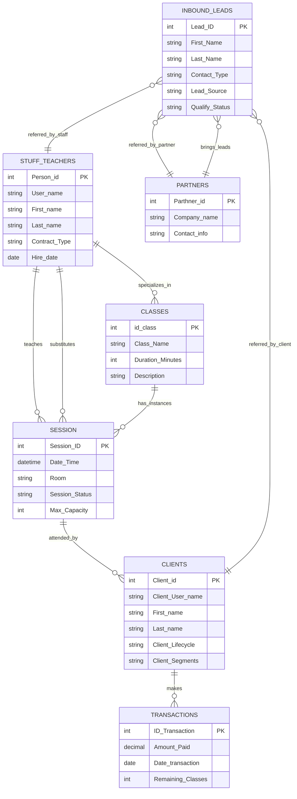

# ⚙️ Airtable ERP (Enterprise Resource Planning) / CRM (Customer Relationship Management) & Ops Automation

> A production-ready collection of **14 native Airtable automations** across HR (Human Resources), CRM, Operations, and Finance — paired with **6 role-specific interfaces** designed to centralize studio management and eliminate manual workflows.

**Contents:** [🗄️ Database Schema](#database-schema) · [🖥️ Interface Map](#interface-map) · [⚡ Automation Overview](#automation-overview) · [🗺️ ER Diagram](#er-diagram) · [🔗 Tech Stack](#tech-stack) · [📂 Documentation](#documentation)

---

## 📌 What This Project Is

This repository documents the internal automation infrastructure of a yoga studio built entirely on **Airtable** — without external tools or code. The system covers the full operational lifecycle: from hiring and contract management, to lead qualification and client onboarding, to class scheduling and revenue tracking.

Each automation is triggered by real business events — a contract expiring, a lead converting, a class completing — and responds by updating records, creating entries across linked tables, and logging activity. The result is a self-maintaining operational backbone that keeps data clean, teams aligned, and nothing falling through the cracks.

Documentation is organized into domain-specific sections: HR & Staff Management, CRM & Lead Management, Operations & Scheduling, Finance & Transactions, and Interface Map — each containing a full technical deep dive, user workflows, and field-level reference. See [Detailed Documentation](#-detailed-documentation) at the end of this file.

> ⚠️ **Data Privacy Note:** All datasets are synthetically generated. Names, contact details, and financial figures are fictional and used for demonstration purposes only.

---

## 🗄️ Database Schema

The automation system operates across **7 core Airtable tables**, each serving a distinct role in the operational pipeline:

| Table | Role |
|---|---|
| `Stuff & Teachers` | Central HR record — contracts, specializations, approval status |
| `Classes` | Class catalog — types, qualified teachers, capacity |
| `Session` | Schedule — individual class instances, rooms, attendance |
| `Inbound_Leads` | CRM intake — all incoming inquiries before conversion |
| `Clients` | Converted clients — lifecycle, segments, LTV (Lifetime Value) |
| `Partners` | Partner directory — companies, contacts |
| `Transactions` | Financial records — payments linked to clients and subscription plans |

---

## 🖥️ Interface Map

**6 role-specific Airtable interfaces** serve as the operational layer through which every team member interacts with the system. Rather than working directly in raw Airtable tables, users manage all studio processes through purpose-built interfaces — including HR hiring and contract renewals, session scheduling and teacher coordination, front-desk client registration and plan sales, lead qualification and retention tracking, campaign and event management, and website content publishing.

Each interface is scoped to a specific role and surfaces only the data and actions relevant to that stakeholder — keeping workflows fast, focused, and error-resistant.

| Interface | Purpose | Stakeholders |
|---|---|---|
| **Studio HR Hub** | 360° team management — from hiring to contract renewals | HR, Admin |
| **Studio Operations Hub** | Centralize monthly scheduling, class oversight, and teacher management | HR, Admin |
| **Check-in & Sales Hub** | Front-desk operations — client registration, plan sales, and session check-ins | Marketing, Admin |
| **Marketing Ops Hub** | Campaign management, partnership tracking, and event coordination | Marketing |
| **Sales Ops Hub** | Lead qualification funnel, client portfolio health, and retention metrics | Sales |
| **Web Operations Hub** | Website content management — events, gallery, and AI-translated media sync | Marketing |

→ [Full interface breakdown — pages, stakeholders & automation links](./interfaces-README.md)

---

## ⚡ Automation Overview

**14 native Airtable automations** across 4 operational domains:

- **HR (Human Resources) & Staff Management** — contract renewal pipeline + teacher-class sync
- **CRM (Customer Relationship Management) & Lead Management** — lead migration to destination tables + activity logging
- **Operations & Scheduling** — recurring session generation + event-to-calendar sync
- **Finance & Transactions** — new client transaction creation from form submission

---

### 📁 HR (Human Resources) & Staff Management — 6 automations
*Contract Renewal Pipeline + Teacher → Class Assignment*

| # | Automation | Trigger | Source Table | Destination Table | Interface |
|---|---|---|---|---|---|
| 1 | [HR] Auto-start Renewal | `Update on Contract(Renew)` field updated | `Stuff & Teachers` | `Stuff & Teachers` | Studio HR Hub → Contract Renewal Management |
| 2 | Done: Auto-mark Renewal as Done | `CDD_End_Date` updated + conditions met | `Stuff & Teachers` | `Stuff & Teachers` | Studio HR Hub → Contract Renewal Management |
| 3 | Non-Renewal: Auto-Close | Record matches Termination conditions | `Stuff & Teachers` | `Stuff & Teachers` | Studio HR Hub → Contract Renewal Management |
| 4 | [HR] Renewal: Finalize & Reset | `CDD_Renewal Progress = Done` | `Stuff & Teachers` | `Stuff & Teachers` | Studio HR Hub → Contract Renewal Management |
| 5 | Teacher Approval to Class Workflow | New teacher approved + Specialization filled | `Stuff & Teachers` | `Classes` | Studio HR Hub → Staff Directory |
| 6 | Update Teacher Sync Class | `Specialization` field updated | `Stuff & Teachers` | `Classes` | Studio HR Hub → Staff Directory / Studio Operations Hub → Teacher Profiles |

→ [Tech deep dive, user workflow & demo](./hr-staff-management-README.md)

---

### 📁 CRM (Customer Relationship Management) & Lead Management — 5 automations
*Lead Migration Pipeline + Activity Log Automation*

| # | Automation | Trigger | Source Table | Destination Table | Interface |
|---|---|---|---|---|---|
| 7 | LEAD MIGRATION: Clients | `Qualify_Status = Positive` + `Contact_Type = Client` | `Inbound_Leads` | `Clients` | Sales Ops Hub → Lead Management Board |
| 8 | LEAD MIGRATION: Partners | `Qualify_Status = Positive` + `Contact_Type = Partner` | `Inbound_Leads` | `Partners` | Sales Ops Hub → Lead Management Board |
| 9 | LEAD MIGRATION: Stuff | `Qualify_Status = Positive` + `Contact_Type = Hiring_Stuff` | `Inbound_Leads` | `Stuff & Teachers` | Sales Ops Hub → Lead Management Board |
| 10 | LEAD MIGRATION: Teachers | `Qualify_Status = Positive` + `Contact_Type = Yoga_Teacher` | `Inbound_Leads` | `Stuff & Teachers` | Sales Ops Hub → Lead Management Board |
| 11 | Lead Management: Archive Notes | `Notes` + `Next_Step_Date` both filled | `Inbound_Leads` | `Inbound_Leads` | Sales Ops Hub → Lead Management Board |

→ [Tech deep dive, user workflow & demo](./crm-lead-management-README.md)

---

### 📁 Operations & Scheduling — 2 automations
*Recurring Sessions + Event → Calendar Sync*

| # | Automation | Trigger | Source Table | Destination Table | Interface |
|---|---|---|---|---|---|
| 12 | Recurring Sessions Generator | `Session_Status = Completed` + `Recurring = ✅` | `Session` | `Session` | Studio Operations Hub → Monthly Studio Planner |
| 13 | Sync Event to Studio Calendar | Campaign `In Progress` + `Campaigne_Type = Event/Workshop` | `Marketing_Campaigns` | `Session` | Marketing Ops Hub → Event Lifecycle Manager |

→ [Tech deep dive, user workflow & demo](./operations-scheduling-README.md)

---

### 📁 Finance & Transactions — 1 automation
*New Client Transaction Sync*

| # | Automation | Trigger | Source Table | Destination Table | Interface |
|---|---|---|---|---|---|
| 14 | SYNC TRANSACTIONS TO NEW CLIENT | Form `New Client Registration & Sale` submitted | `Clients` | `Transactions` | Check-in & Sales Hub → New Client Registration & Sale |

→ [Tech deep dive, user workflow & demo](./finance-transactions-README.md)

---

## 🗺️ Entity Relationship Diagram

---

## 🔗 Tech Stack

| Layer | Tool | Role |
|---|---|---|
| Database & Automations | **Airtable** | Single source of truth — all data, logic, and automations live here |
| Interfaces | **Airtable Interfaces** | Role-based operational dashboards |
| Media CDN (Content Delivery Network) | **Cloudinary** | Image and video hosting for website gallery |
| Website Sync | **GitHub API (Application Programming Interface)** | Events and gallery JSON pushed to website repo |
| ETL (Extract, Transform, Load) & External Sync | **Make (Integromat)** | Analytics data sync to Google Sheets → Looker Studio |

---

## 📂 Detailed Documentation

| Section | Description |
|---|---|
| [HR & Staff Management](./hr-staff-management-README.md) | Contract Renewal Pipeline + Teacher → Class Assignment |
| [CRM & Lead Management](./crm-lead-management-README.md) | Lead Migration Pipeline + Activity Log Automation |
| [Operations & Scheduling](./operations-scheduling-README.md) | Recurring Sessions + Event → Calendar Sync |
| [Finance & Transactions](./finance-transactions-README.md) | New Client Transaction Sync |
| [Interface Map](./interfaces-README.md) | All 6 hubs — pages, stakeholders, and automation links |

---

*Documentation in progress. Screenshots and flow diagrams will be added per section.*

