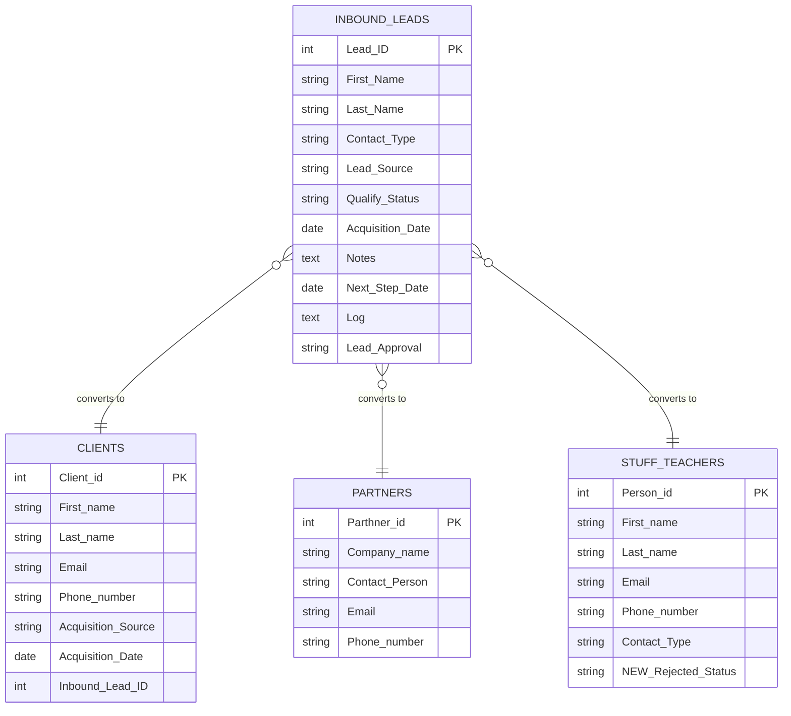

# 📁 CRM & Lead Management

> **5 native Airtable automations** covering the full lead qualification lifecycle — from incoming inquiry to converted record, with automatic activity logging throughout.

---

## Tables Involved



---

## Contents

- [Lead Migration Pipeline](#lead-migration-pipeline)
- [Activity Log Automation](#activity-log-automation)
- [Interface](#interface)

---

## Lead Migration Pipeline

### Overview

When a lead is qualified and marked **Positive**, one of four automations fires based on `Contact_Type` — automatically creating a record in the correct destination table with all relevant contact data pre-filled.

```
Inbound Lead → Qualify_Status = Positive
                        ↓
        ┌───────────────┼───────────────────┐
        │               │                   │
Contact_Type      Contact_Type        Contact_Type      Contact_Type
= Client          = Partner           = Hiring_Stuff    = Yoga_Teacher
        │               │                   │                │
        ↓               ↓                   ↓                ↓
  CREATE record    CREATE record      CREATE record    CREATE record
  in Clients       in Partners        in Stuff &       in Stuff &
                                      Teachers         Teachers
                                                    (+ Contact Type
                                                     = Yoga_Teacher)
```

> 📌 **Roadmap:** The Lead Management Board will be split into two dedicated pipelines — **HR Pipeline** (Teachers & Staff) and **Commerce Pipeline** (Clients & Partners) — to better reflect the distinct workflows for each contact type.

---

### Automation 1 — LEAD MIGRATION: Clients

**Trigger:** Record matches conditions in `Inbound Leads`
**Condition:** `Qualify_Status = Positive` AND `Contact_Type = Client`

**Action:** Creates record in `Clients`:

| Destination Field | Source Field |
|---|---|
| `First_name` | `First_Name` |
| `Last_name` | `Last_Name` |
| `Phone_number` | `Phone_number` |
| `Email` | `Email` |
| `Acquisition Source` | `Lead_Source` |
| `Acquisition_Date` | `Acquisition_Date` |
| `Inbound_Lead_ID` | `Lead_ID` |

---

### Automation 2 — LEAD MIGRATION: Partners

**Trigger:** Record matches conditions in `Inbound Leads`
**Condition:** `Qualify_Status = Positive` AND `Contact_Type = Partner`

**Action:** Creates record in `Partners`:

| Destination Field | Source Field |
|---|---|
| `Company_name` | `Company_name` |
| `Contact Person` | `First_Name` + `Last_Name` |
| `Email` | `Email` |
| `Phone number` | `Phone_number` |

---

### Automation 3 — LEAD MIGRATION: Stuff

**Trigger:** Record matches conditions in `Inbound Leads`
**Condition:** `Qualify_Status = Positive` AND `Contact_Type = Hiring_Stuff`

**Action:** Creates record in `Stuff & Teachers`:

| Destination Field | Source Field |
|---|---|
| `First_name` | `First_Name` |
| `Last_name` | `Last_Name` |
| `Phone_number` | `Phone_number` |
| `Email` | `Email` |
| `NEW:Rejected_Status` | `Not Rejected` (hardcoded) |

---

### Automation 4 — LEAD MIGRATION: Teachers

**Trigger:** Record matches conditions in `Inbound Leads`
**Condition:** `Qualify_Status = Positive` AND `Contact_Type = Yoga_Teacher`

**Action:** Creates record in `Stuff & Teachers`:

| Destination Field | Source Field |
|---|---|
| `First_name` | `First_Name` |
| `Last_name` | `Last_Name` |
| `Phone_number` | `Phone_number` |
| `Email` | `Email` |
| `NEW:Rejected_Status` | `Not Rejected` (hardcoded) |
| `Contact Type` | `Yoga_Teacher` (hardcoded) |

> Once created, the teacher record enters the **Teacher → Class Assignment** pipeline automatically. See [HR & Staff Management](../hr-staff-management/README.md).

---

### User Workflow

```
1. Lead arrives (from Instagram, website, referral, event etc.)
   → Record created in Inbound Leads automatically or manually

2. Sales reviews the lead on the Lead Management Board (Kanban)
   → Moves through statuses: MQL → Not Reached → SQL

3. Sales opens the lead card:
   → Reviews contact details, lead type, original message
   → Uses Lead Approval field to approve or reject
   → Adds Notes and sets Next_Step_Date for follow-up

4. When lead is ready:
   → Sales sets Qualify_Status = Positive
   → Correct migration automation fires instantly
   → New record appears in destination table (Clients / Partners / Stuff & Teachers)
   → Lead remains in Inbound Leads for attribution tracking
```

---

## Activity Log Automation

### Overview

Every time a sales rep adds notes and a next step date to a lead card, the automation **archives the interaction to a running activity log** — and clears the notes field when the follow-up date is reached.

```
Sales adds Notes + Next_Step_Date to lead card
                    ↓
        Action 1 — Archive to Log
        Log field updated with:
        ✅ [timestamp]
        📝 [Notes content]
        📅 [Next_Step_Date]
        🔄 [Previous Log entries]
                    ↓
        Next_Step_Date reaches today or passes
                    ↓
        Action 2 — Clear Notes
        Notes field → empty
        (Log entry preserved)
```

---

### Automation 5 — Lead Management: Archive Notes to Activity Log

**Trigger:** Record matches conditions in `Inbound Leads`
**Condition:** `Notes` is not empty AND `Next_Step_Date` is not empty

**Action 1 — Always:** Updates `Log` field in `Inbound Leads`:

```
✅ [RECORD IS UPDATED ON] {Actual run time}

📝 [LAST UPDATE DETAILS] : {Notes}

📅 [NEXT STEP DATE] : {Next_Step_Date}

🔄 [PREVIOUS ACTIONS DETAILS] : {Log}
```

**Action 2 — Conditional:** If `Next_Step_Date` is on or before today:
- `Notes` → cleared

---

### Key Fields

| Field | Type | Description |
|---|---|---|
| `Qualify_Status` | Single select | `MQL` → `Not Reached` → `SQL` → `Positive` / `Rejected` |
| `Contact_Type` | Single select | `Client` / `Partner` / `Hiring_Stuff` / `Yoga_Teacher` / `Event_Registrant` |
| `Lead_Source` | Single select | Instagram, Telegram, Website, Referral, Event, LinkedIn, Maps, Other |
| `Lead_Approval` | Single select | Approve or reject a lead from the board |
| `Notes` | Text | Sales rep interaction notes — triggers Activity Log automation |
| `Next_Step_Date` | Date | Follow-up date — triggers log archive + note clear |
| `Log` | Long text | Running activity log — appended automatically on each update |
| `Acquisition_Date` | Date | Date lead entered the database |

---

## Interface

All 5 CRM automations are managed from:

**🖥️ Sales Ops Hub → Lead Management Board**
Kanban board across all qualification statuses. Lead cards surface contact details, lead type, original message, notes, and next step date. Migration automations fire from status changes made here.

> 📌 In a future iteration this board will be split into:
> - **HR Pipeline** — Teachers & Staff qualification
> - **Commerce Pipeline** — Clients & Partners qualification

---

*[← Back to main README](../README.md)*
