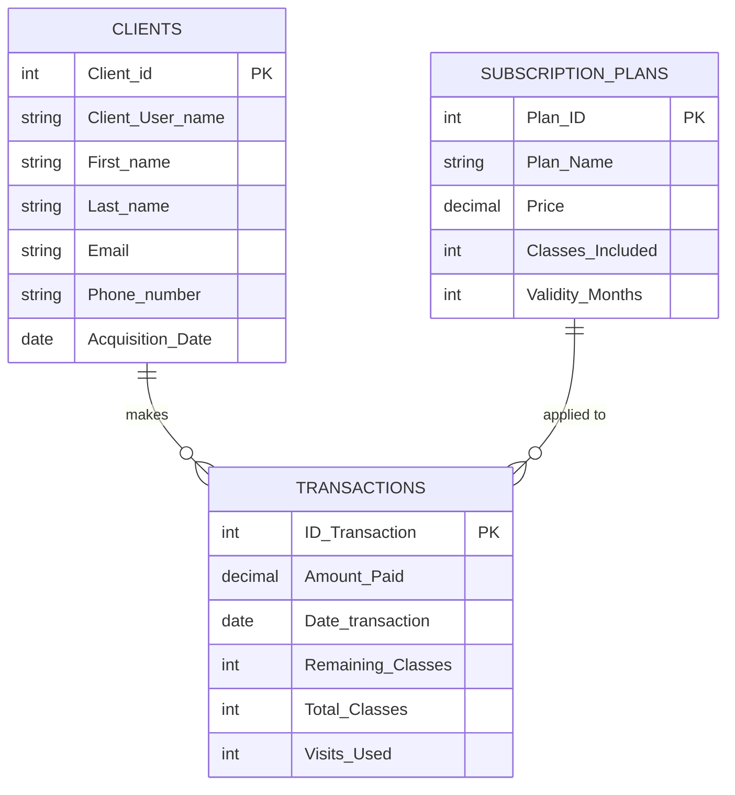

# 📁 Finance & Transactions

> **1 native Airtable automation** triggered by a form submission — instantly creating a linked transaction record when a new client is registered and a subscription plan is sold.

---

## Tables Involved



---

## Contents

- [New Client Transaction Sync](#new-client-transaction-sync)
- [Key Fields](#key-fields)
- [Interface](#interface)

---

## New Client Transaction Sync

### Overview

When the studio administrator submits the **New Client Registration & Sale** form, two things happen simultaneously: a new client record is created in `Clients`, and the automation immediately creates a corresponding transaction in `Transactions` — linking the client to their purchased subscription plan.

```
Administrator submits form:
"New Client Registration & Sale Classes/Events"
                ↓
Client record created in Clients table
                ↓
[1] SYNC TRANSACTIONS TO NEW CLIENT fires
                ↓
New record created in Transactions:
    ├── Client        → linked to new Client record
    └── Subscription Plan → linked to selected plan
```

---

### Automation 1 — SYNC TRANSACTIONS TO NEW CLIENT

**Trigger:** Form submitted — `New Client Registration & Sale Classes/Events`
**Table:** `Clients`

**Action:** Creates record in `Transactions`:

| Field | Value |
|---|---|
| `Client` | Linked to `Client_User_name` from submitted form |
| `Subscription Plan` | Linked to `Subscription_Plan` selected in form |

---

### Form: New Client Registration & Sale Classes/Events

This is an **internal administrator form** — used at the front desk when a new client walks in for the first time or registers at an event.

**Form flow:**

```
1. Admin opens Check-in & Sales Hub
2. Navigates to New Client Registration & Sale page
3. Fills in client details:
   → First name, Last name, Email, Phone
   → Acquisition Source (how they heard about the studio)
   → Subscription Plan (which plan they are purchasing)
   → If event attendee: selects Event Special Ticket

4. Submits the form
   → Client record created in Clients table
   → Transaction record created automatically
   → Client is now active in the system
```

---

### Post-Registration Workflow

After the initial registration and transaction sync, the admin continues in the same interface:

```
New Client registered + Transaction created
                ↓
If client attended an event:
   → Admin goes to Existing Client Event Registration
   → Finds the event card
   → Links the new client to the event attendance list

If client is attending a regular class:
   → Admin goes to Class/Event Check-in
   → Registers client attendance for the session
```

---

## Key Fields

| Field | Table | Type | Description |
|---|---|---|---|
| `Client_User_name` | `Clients` | Text | Unique client identifier — used to link transaction |
| `Subscription Plan` | `Transactions` | Linked record | References `Subscription_Plans` table |
| `Amount_Paid` | `Transactions` | Currency | Payment amount — populated from plan price |
| `Total_Classes` | `Transactions` | Number | Classes included in purchased plan |
| `Remaining_Classes` | `Transactions` | Formula | `Total_Classes - Visits_Used` |
| `Visits_Used` | `Transactions` | Rollup | COUNT of linked attendance records |
| `Date_transaction` | `Transactions` | Date | Date of purchase |
| `Plan_Name` | `Subscription_Plans` | Text | Name of the membership plan |
| `Price` | `Subscription_Plans` | Currency | Plan price — referenced in transaction |
| `Classes_Included` | `Subscription_Plans` | Number | Total classes per plan |
| `Validity_Months` | `Subscription_Plans` | Number | Plan duration in months |

---

## Interface

**🖥️ Check-in & Sales Hub → New Client Registration & Sale**
Internal administrator form. Submitting this form triggers the automation. Used at the front desk for first-time client registration and plan purchase — including event special tickets.

**🖥️ Check-in & Sales Hub → Existing Client Event Registration**
Follow-up step after registration — links the new client to a specific event attendance list.

**🖥️ Check-in & Sales Hub → Class/Event Check-in**
Used to register client attendance for regular sessions after registration is complete.

> 📌 For returning clients purchasing a new plan, the **Existing Client Sale** page is used instead — which does not trigger this automation as the client already exists in the system.

---

*[← Back to main README](../README.md)*
