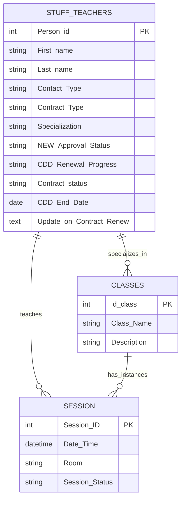

# 📁 HR (Human Resources) & Staff Management

> **6 native Airtable automations** covering the full employee lifecycle — from contract renewal tracking to teacher-class assignment synchronization.

**Contents:** [🖥️ Interface](#interface) · [⚡ Automation Overview](#automation-overview) · [👤 User Workflows](#user-workflows) · [🎬 Demo](#demo) · [🔬 Technical Deep Dive](#technical-deep-dive)

---

## What This Module Does

From a business perspective, this module solves two recurring operational problems:

**Contract renewals don't get lost.** Every CDD (fixed-term) employee whose contract is approaching expiry automatically enters a tracked renewal pipeline — moving through stages from first discussion to final reset, with no manual status changes required from HR. The system handles the progression; HR handles the conversation.

**Teacher rosters stay accurate without manual linking.** When a new teacher is onboarded and approved, or an existing teacher updates their specializations, the relevant yoga classes in the system are updated automatically. HR never needs to manually connect a teacher to a class type.

---

## 🎬 Demo

> 📹 *Walkthrough video — coming soon.*
> Screenshots and step-by-step demo for Contract Renewal Pipeline and Teacher Assignment flow will be added here.

---

## 🖥️ Interface

All 6 HR automations are managed through two interfaces. Here is what each entry point controls and what happens behind the scenes.

### Studio HR Hub

The primary HR workspace. HR managers and admins use this interface for all people operations — from hiring pipeline to offboarding.

| Page | What the user does here | Automations triggered |
|---|---|---|
| **🔄 Contract Renewal Management** | Reviews employees with `🟡 Renewal Required` status. Opens employee cards, writes renewal notes, updates contract dates, or marks termination. | Auto-start Renewal (1), Auto-mark Done (2), Non-Renewal Auto-Close (3), Finalize & Reset (4) |
| **📂 Staff Directory** | Views full staff records. Edits teacher specializations and contact details. Approves or rejects new hires via `NEW:Approval Status`. | Teacher Approval to Class Workflow (5), Update Teacher Sync Class (6) |
| **🚀 HR Control Center** | High-level overview of all HR processes — active staff, pending renewals, onboarding pipeline, absence summary. Entry point for daily HR operations. | — (read-only overview) |
| **⏳ New Staff Onboarding** | Manages new hires from offer acceptance through to system setup and first session. | — |
| **✍️ Staff Absence Form** | Logs sick leave, holidays, and planned absences. | — |
| **📋 Staff Absence Reporting** | Overview of all logged absences — past, current, and upcoming. Used to plan substitutions. | — |

### Studio Operations Hub

Used by HR and admins for scheduling operations. Provides an alternative entry point for teacher data management.

| Page | What the user does here | Automations triggered |
|---|---|---|
| **👤 Teacher Profiles** | Views teacher cards — contact info, specializations, active classes, session history. Updating specializations here re-syncs the teacher across all linked class types. | Update Teacher Sync Class (6) |
| **📅 Monthly Studio Planner** | Creates and manages sessions, sets recurring toggles, marks sessions as completed. | — (Recurring Sessions is in Operations module) |

---

## ⚡ Automation Overview

6 automations covering two independent pipelines:

**Contract Renewal Pipeline (automations 1–4)** — a sequential state machine. Each automation picks up where the previous one left off, moving a CDD employee record through the full renewal cycle without HR manually changing statuses. HR's only job is to write notes, update dates, and make the actual contract decision. The system handles the rest.

**Teacher → Class Assignment (automations 5–6)** — a sync mechanism. Keeps the `Classes` table always up to date with the correct list of qualified teachers. Fires once on new teacher approval, and again whenever a teacher's specializations change later.

| # | Automation | Trigger | Source Table | Destination Table | Interface |
|---|---|---|---|---|---|
| 1 | [HR] Auto-start Renewal | `Update on Contract(Renew)` field updated | `Stuff & Teachers` | `Stuff & Teachers` | Studio HR Hub → Contract Renewal Management |
| 2 | Done: Auto-mark Renewal as Done | `CDD_End_Date` updated + conditions met | `Stuff & Teachers` | `Stuff & Teachers` | Studio HR Hub → Contract Renewal Management |
| 3 | Non-Renewal: Auto-Close | Record matches Termination conditions | `Stuff & Teachers` | `Stuff & Teachers` | Studio HR Hub → Contract Renewal Management |
| 4 | [HR] Renewal: Finalize & Reset | `CDD_Renewal Progress = Done` | `Stuff & Teachers` | `Stuff & Teachers` | Studio HR Hub → Contract Renewal Management |
| 5 | Teacher Approval to Class Workflow | New teacher approved + Specialization filled | `Stuff & Teachers` | `Classes` | Studio HR Hub → Staff Directory |
| 6 | Update Teacher Sync Class | `Specialization` field updated | `Stuff & Teachers` | `Classes` | Studio HR Hub → Staff Directory / Studio Operations Hub → Teacher Profiles |

---

## 👤 User Workflows

### Contract Renewal Pipeline

```
1. HR opens Contract Renewal Management board (Studio HR Hub)
   → Employees with 🟡 Renewal Required appear automatically
   → Status is formula-driven — no manual flagging needed

2. HR opens the employee card and writes renewal notes
   in "Update on Contract(Renew)" field
   → [1] Auto-start fires → CDD_Renewal Progress moves to In Discussion
   → Timestamp logged automatically

3. HR manages the negotiation, prepares documentation

4a. If renewing:
    → HR updates CDD_End_Date with the new future contract date
    → [2] Auto-mark fires → Progress moves to Done
    → [4] Finalize & Reset fires → notes cleared, cycle resets to Not Started

4b. If not renewing:
    → HR sets CDD_Renewal Progress to Termination
    → After final working day, Contract_status formula = 🔴 Inactive
    → [3] Non-Renewal Auto-Close fires → Done + reason logged + record archived
    → [4] Finalize & Reset fires → cycle closes

4c. If transitioning from CDD to CDI:
    → HR changes Contract Type to CDI
    → Employee exits the CDD pipeline automatically — no further action needed
```

### Teacher → Class Assignment

```
1. HR creates a new teacher record in Staff Directory (Studio HR Hub)
2. HR fills in Specialization (e.g. Hatha, Vinyasa)
3. HR leaves NEW:Approval Status empty (not rejected)
   → [5] Teacher Approval to Class Workflow fires automatically
   → Teacher is linked to matching Classes in Qualified Teachers field

4. Later, if teacher adds or changes a specialization:
   → HR updates Specialization in Staff Directory or Teacher Profiles
   → [6] Update Teacher Sync Class fires
   → All linked Classes are re-synced with the updated teacher record
```

---

## 🔬 Technical Deep Dive

### Context: CDD vs CDI

The studio employs staff under two contract types:

| Type | Full Name | Description |
|---|---|---|
| **CDD** | Contrat à Durée Déterminée | Fixed-term contract with a defined end date — requires active renewal tracking |
| **CDI** | Contrat à Durée Indéterminée | Permanent contract with no end date — no renewal cycle needed |

All 4 Contract Renewal automations apply exclusively to **CDD** employees.

---

### Tables Involved



---

### Contract Renewal Pipeline — Flow

```
HR adds note to "Update on Contract(Renew)"
            ↓
[1] Auto-start Renewal
    CDD_Renewal Progress → In Discussion
    Timestamp logged
            ↓
    HR manages the process:
    negotiates terms, prepares contract, sends it
            ↓
        ┌───────────────────────────────────┐
        │                                   │
[2] Auto-mark as Done              [3] Non-Renewal Auto-Close
    CDD_End_Date updated               CDD_Renewal Progress = Termination
    + Contract Sent                    + Contract_status = Inactive
    → Progress = Done                  → Progress = Done
    → Contract_status = Active         → Reason logged + Archived
        │                                   │
        └──────────────┬────────────────────┘
                       ↓
            [4] Finalize & Reset
                Notes cleared
                CDD_Renewal Progress → Not Started
                Ready for next renewal cycle
```

---

### Automation 1 — [HR] Auto-start Renewal

**Trigger:** Record updated in `Stuff & Teachers` — field `Update on Contract(Renew)`
**View:** 🗂️ [All] Master Grid
**Condition:** `Contract_status = 🟡 Renewal Required` AND `CDD_Renewal Progress = Not Started`

**Action:** Updates `Stuff & Teachers`:
- `CDD_Renewal Progress` → `In Discussion`
- `Discussion started on` → current timestamp

**What this replaces:** HR manually changing the status after writing a note.

---

### Automation 2 — Done: Auto-mark Renewal as Done

**Trigger:** Record updated in `Stuff & Teachers` — field `CDD_End_Date`
**Condition:** `Contract Type = CDD` AND `Contract_status = 🟢 Active` AND `CDD_Renewal Progress = Contract Sent`

**Action:** Updates `Stuff & Teachers`:
- `CDD_Renewal Progress` → `Done`
- Logs renewal confirmation via `Helper_Log_Text` formula

**What this replaces:** HR manually closing the renewal after sending the new contract.

---

### Automation 3 — Non-Renewal: Auto-Close

**Trigger:** Record matches conditions in `Stuff & Teachers`
**Condition:** `CDD_Renewal Progress = Termination/Non-Renewal` AND `Contract_status = 🔴 Inactive (Terminated)`

**Action:** Updates `Stuff & Teachers`:
- `CDD_Renewal Progress` → `Done`
- Logs `Reason_for_leaving` + final working day
- Moves employee to Archive

**What this replaces:** HR manually closing terminated employee records.

---

### Automation 4 — [HR] Renewal: Finalize & Reset

**Trigger:** Record matches conditions in `Stuff & Teachers`
**Condition:** `CDD_Renewal Progress = Done`

**Action:** Updates `Stuff & Teachers`:
- `Update on Contract(Renew)` → cleared (populated from `Helper_Log_Text`)
- `CDD_Renewal Progress` → `Not Started`

**What this replaces:** Manual cleanup after each renewal cycle.

---

### Teacher → Class Assignment — Flow

```
New teacher record created + Specialization filled + Approved
            ↓
[5] Teacher Approval to Class Workflow
    Teacher linked to Classes.Qualified Teachers
            ↓
    Teacher updates their Specialization later
            ↓
[6] Update Teacher Sync Class
    Finds all linked Classes
    Re-syncs Qualified Teachers across all of them
```

---

### Automation 5 — Teacher Approval to Class Workflow

**Trigger:** Record matches conditions in `Stuff & Teachers`
**Condition:** `Contact Type = Yoga_Teacher` AND `NEW:Approval Status` is empty AND `Specialization` is not empty

**Action:** Updates `Classes`:
- `Qualified Teachers` → adds teacher's Airtable record ID

**What this replaces:** Manually linking teachers to class types after onboarding.

---

### Automation 6 — Update Teacher Sync Class

**Trigger:** Record updated in `Stuff & Teachers` — field `Specialization`
**View:** 🧘‍♂️ [Teaching] Active Yoga Staff

**Action (looped):**
1. Finds all records in `Stuff & Teachers` where `Person_id` matches
2. Repeats for each item in `Specialization`
3. Updates `Classes.Qualified Teachers` → re-links teacher record ID

**What this replaces:** Manually re-linking a teacher to classes after a specialization change.

---

### Key Fields

#### Contract Renewal

| Field | Type | Logic |
|---|---|---|
| `Contract_status` | Formula | `🟢 Active` / `🟡 Renewal Required` (≤30 days to expiry) / `🔴 Expired` / `🔴 Inactive` / `🟠 Termination Pending` |
| `CDD_Renewal Progress` | Single select | `Not Started` → `In Discussion` → `Contract Sent` → `Done` / `Termination` |
| `CDD_End_Date` | Date | Contract expiry date — key trigger for status formula |
| `CDD_Days_until_expiration` | Formula | Days remaining or `🔴 Expired X days ago` |
| `Update on Contract(Renew)` | Text | HR notes field — writing here triggers Auto-start |
| `Helper_Log_Text` | Formula | System-generated renewal confirmation log |
| `Contract Type` | Single select | `CDD` / `CDI` / `Freelance` |
| `NEW:Approval Status` | Field | Used in `Contract_status` formula to handle rejected candidates |

#### Teacher Assignment

| Field | Table | Description |
|---|---|---|
| `Contact Type` | `Stuff & Teachers` | Must be `Yoga_Teacher` to trigger assignment |
| `Specialization` | `Stuff & Teachers` | Linked to `Classes` — drives which classes teacher qualifies for |
| `NEW:Approval Status` | `Stuff & Teachers` | Must be empty (not rejected) for Automation 5 to fire |
| `Qualified Teachers` | `Classes` | Linked record field — list of approved teachers per class type |
| `Person_id` | `Stuff & Teachers` | Used to find and match records in the repeat loop |

---

### Formulas

#### `Contract_status`

```
IF(
  {NEW:Approval Status} = "❌ Rejected",
  "🔴 Inactive (Rejected)",
  IF({Contract Type} = "CDD",
    IF({CDD_Renewal Progress} = "⛔️ Termination",
      IF(IS_AFTER(TODAY(), {CDD_End_Date}), "🔴 Inactive (Terminated)", "🟠 Termination Pending"),
      IF(IS_AFTER(TODAY(), {CDD_End_Date}), "🔴 Expired",
        IF(DATETIME_DIFF({CDD_End_Date}, TODAY(), 'days') <= 30, "🟡 Renewal Required", "🟢 Active")
      )
    ),
    IF({Contract Type} = "CDI",
      IF(AND({CDI_Termination_Date}, IS_BEFORE({CDI_Termination_Date}, TODAY())),
        "🔴 Inactive", "🟢 Active"
      ),
      IF({Contract Type} = "Freelance", "🟢 Active", "⚪ No Status")
    )
  )
)
```

#### `CDD_Days_until_expiration`

```
IF(
  {CDD_End_Date},
  IF(
    DATETIME_DIFF({CDD_End_Date}, TODAY(), 'days') < 0,
    "🔴 Expired " & ABS(DATETIME_DIFF({CDD_End_Date}, TODAY(), 'days')) & " days ago",
    DATETIME_DIFF({CDD_End_Date}, TODAY(), 'days')
  ),
  "no data"
)
```


*[← Back to main README](./README.md)*
