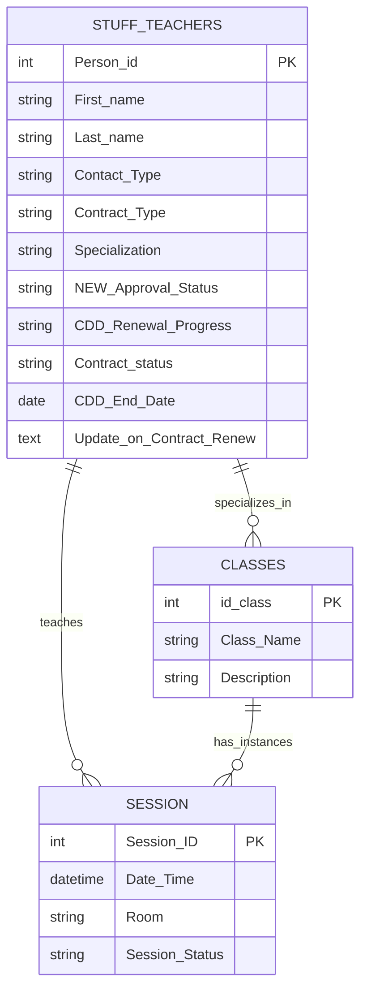

# 📁 HR & Staff Management

> **6 native Airtable automations** covering the full employee lifecycle — from contract renewal tracking to teacher-class assignment synchronization.

---

## Tables Involved



---

## Contents

- [Context: CDD vs CDI](#context-cdd-vs-cdi)
- [Contract Renewal Pipeline](#contract-renewal-pipeline)
- [Teacher → Class Assignment](#teacher--class-assignment)
- [Interface](#interface)

---

## Context: CDD vs CDI

The studio employs staff under two contract types:

| Type | Full Name | Description |
|---|---|---|
| **CDD** | Contrat à Durée Déterminée | Fixed-term contract with a defined end date — requires active renewal tracking |
| **CDI** | Contrat à Durée Indéterminée | Permanent contract with no end date — no renewal cycle needed |

All 4 Contract Renewal automations apply exclusively to **CDD** employees.

---

## Contract Renewal Pipeline

### Overview

Four automations work as a **single sequential pipeline** — each one picks up where the previous left off. The goal is to track every CDD contract through its full renewal lifecycle without manual status updates.

```
HR adds note to "Update on Contract(Renew)"
            ↓
[1] Auto-start Renewal
    CDD_Renewal Progress → In Discussion
    Timestamp logged
            ↓
    HR manages the process:
    negotiates terms, prepares contract, sends it
            ↓
        ┌───────────────────────────────────┐
        │                                   │
[2] Auto-mark as Done              [3] Non-Renewal Auto-Close
    CDD_End_Date updated               CDD_Renewal Progress = Termination
    + Contract Sent                    + Contract_status = Inactive
    → Progress = Done                  → Progress = Done
    → Contract_status = Active         → Reason logged + Archived
        │                                   │
        └──────────────┬────────────────────┘
                       ↓
            [4] Finalize & Reset
                Notes cleared
                CDD_Renewal Progress → Not Started
                Ready for next renewal cycle
```

---

### Automation 1 — [HR] Auto-start Renewal

**Trigger:** Record updated in `Stuff & Teachers` — field `Update on Contract(Renew)`
**View:** 🗂️ [All] Master Grid
**Condition:** `Contract_status = 🟡 Renewal Required` AND `CDD_Renewal Progress = Not Started`

**Action:** Updates `Stuff & Teachers`:
- `CDD_Renewal Progress` → `In Discussion`
- `Discussion started on` → current timestamp

**What this replaces:** HR manually changing the status after writing a note.

---

### Automation 2 — Done: Auto-mark Renewal as Done

**Trigger:** Record updated in `Stuff & Teachers` — field `CDD_End_Date`
**Condition:** `Contract Type = CDD` AND `Contract_status = 🟢 Active` AND `CDD_Renewal Progress = Contract Sent`

**Action:** Updates `Stuff & Teachers`:
- `CDD_Renewal Progress` → `Done`
- Logs renewal confirmation via `Helper_Log_Text` formula

**What this replaces:** HR manually closing the renewal after sending the new contract.

---

### Automation 3 — Non-Renewal: Auto-Close

**Trigger:** Record matches conditions in `Stuff & Teachers`
**Condition:** `CDD_Renewal Progress = Termination/Non-Renewal` AND `Contract_status = 🔴 Inactive (Terminated)`

**Action:** Updates `Stuff & Teachers`:
- `CDD_Renewal Progress` → `Done`
- Logs `Reason_for_leaving` + final working day
- Moves employee to Archive

**What this replaces:** HR manually closing terminated employee records.

---

### Automation 4 — [HR] Renewal: Finalize & Reset

**Trigger:** Record matches conditions in `Stuff & Teachers`
**Condition:** `CDD_Renewal Progress = Done`

**Action:** Updates `Stuff & Teachers`:
- `Update on Contract(Renew)` → cleared (populated from `Helper_Log_Text`)
- `CDD_Renewal Progress` → `Not Started`

**What this replaces:** Manual cleanup after each renewal cycle.

---

### Key Fields

| Field | Type | Logic |
|---|---|---|
| `Contract_status` | Formula | `🟢 Active` / `🟡 Renewal Required` (≤30 days to expiry) / `🔴 Expired` / `🔴 Inactive` / `🟠 Termination Pending` |
| `CDD_Renewal Progress` | Single select | `Not Started` → `In Discussion` → `Contract Sent` → `Done` / `Termination` |
| `CDD_End_Date` | Date | Contract expiry date — key trigger for status formula |
| `CDD_Days_until_expiration` | Formula | Days remaining or `🔴 Expired X days ago` |
| `Update on Contract(Renew)` | Text | HR notes field — writing here triggers Auto-start |
| `Helper_Log_Text` | Formula | System-generated renewal confirmation log |
| `Contract Type` | Single select | `CDD` / `CDI` / `Freelance` |
| `NEW:Approval Status` | Field | Used in Contract_status formula to handle rejected candidates |

#### Formula: `Contract_status`

```
IF(
  {NEW:Approval Status} = "❌ Rejected",
  "🔴 Inactive (Rejected)",
  IF({Contract Type} = "CDD",
    IF({CDD_Renewal Progress} = "⛔️ Termination",
      IF(IS_AFTER(TODAY(), {CDD_End_Date}), "🔴 Inactive (Terminated)", "🟠 Termination Pending"),
      IF(IS_AFTER(TODAY(), {CDD_End_Date}), "🔴 Expired",
        IF(DATETIME_DIFF({CDD_End_Date}, TODAY(), 'days') <= 30, "🟡 Renewal Required", "🟢 Active")
      )
    ),
    IF({Contract Type} = "CDI",
      IF(AND({CDI_Termination_Date}, IS_BEFORE({CDI_Termination_Date}, TODAY())),
        "🔴 Inactive", "🟢 Active"
      ),
      IF({Contract Type} = "Freelance", "🟢 Active", "⚪ No Status")
    )
  )
)
```

#### Formula: `CDD_Days_until_expiration`

```
IF(
  {CDD_End_Date},
  IF(
    DATETIME_DIFF({CDD_End_Date}, TODAY(), 'days') < 0,
    "🔴 Expired " & ABS(DATETIME_DIFF({CDD_End_Date}, TODAY(), 'days')) & " days ago",
    DATETIME_DIFF({CDD_End_Date}, TODAY(), 'days')
  ),
  "no data"
)
```

---

### User Workflow

```
1. HR reviews Contract Renewal Management board
   → Employees with 🟡 Renewal Required appear automatically

2. HR opens the employee card and writes renewal notes
   in "Update on Contract(Renew)" field
   → [1] Auto-start fires → status moves to In Discussion

3. HR manages the negotiation, prepares documentation

4a. If renewing:
    → HR updates CDD_End_Date with the new future date
    → [2] Auto-mark fires → status moves to Done
    → [4] Finalize & Reset fires → cycle resets to Not Started

4b. If not renewing:
    → HR sets CDD_Renewal Progress to Termination
    → After final working day, Contract_status = Inactive
    → [3] Non-Renewal Auto-Close fires → Done + Archived
    → [4] Finalize & Reset fires → cycle closes

4c. If transitioning to CDI:
    → HR changes Contract Type to CDI
    → Employee exits the CDD pipeline automatically
```

---

## Teacher → Class Assignment

### Overview

Two automations keep the `Classes` table in sync with the `Stuff & Teachers` table — ensuring that every class always has an up-to-date list of qualified teachers without manual linking.

```
New teacher record created + Specialization filled + Approved
            ↓
[5] Teacher Approval to Class Workflow
    Teacher linked to Classes.Qualified Teachers
            ↓
    Teacher updates their Specialization later
            ↓
[6] Update Teacher Sync Class
    Finds all linked Classes
    Re-syncs Qualified Teachers across all of them
```

---

### Automation 5 — Teacher Approval to Class Workflow

**Trigger:** Record matches conditions in `Stuff & Teachers`
**Condition:** `Contact Type = Yoga_Teacher` AND `NEW:Approval Status` is empty AND `Specialization` is not empty

**Action:** Updates `Classes`:
- `Qualified Teachers` → adds teacher's Airtable record ID

**What this replaces:** Manually linking teachers to class types after onboarding.

---

### Automation 6 — Update Teacher Sync Class

**Trigger:** Record updated in `Stuff & Teachers` — field `Specialization`
**View:** 🧘‍♂️ [Teaching] Active Yoga Staff

**Action (looped):**
1. Finds all records in `Stuff & Teachers` where `Person_id` matches
2. Repeats for each item in `Specialization`
3. Updates `Classes.Qualified Teachers` → re-links teacher record ID

**What this replaces:** Manually re-linking a teacher to classes after a specialization change.

---

### Key Fields

| Field | Table | Description |
|---|---|---|
| `Contact Type` | `Stuff & Teachers` | Must be `Yoga_Teacher` to trigger assignment |
| `Specialization` | `Stuff & Teachers` | Linked to `Classes` — drives which classes teacher qualifies for |
| `NEW:Approval Status` | `Stuff & Teachers` | Must be empty (not rejected) for Automation 5 to fire |
| `Qualified Teachers` | `Classes` | Linked record field — list of approved teachers per class type |
| `Person_id` | `Stuff & Teachers` | Used to find and match records in the repeat loop |

---

### User Workflow

```
1. HR creates a new teacher record in Staff Directory
2. HR fills in Specialization (e.g. Hatha, Vinyasa)
3. HR leaves NEW:Approval Status empty (not rejected)
   → [5] fires automatically → teacher linked to Classes

4. Later, if teacher adds a new specialization:
   → HR updates Specialization field in Teacher Profiles
   → [6] fires → all linked Classes updated automatically
```

---

## Interface

All 6 HR automations are managed from a single interface:

**🖥️ Studio HR Hub → Contract Renewal Management**
All 4 contract renewal automations are triggered by actions taken on this board.

**🖥️ Studio HR Hub → Staff Directory**
Teacher approval and specialization updates trigger automations 5 and 6.

**🖥️ Studio Operations Hub → Teacher Profiles**
Alternative entry point for updating teacher specializations and contact details.

---

*[← Back to main README](./README.md)*
