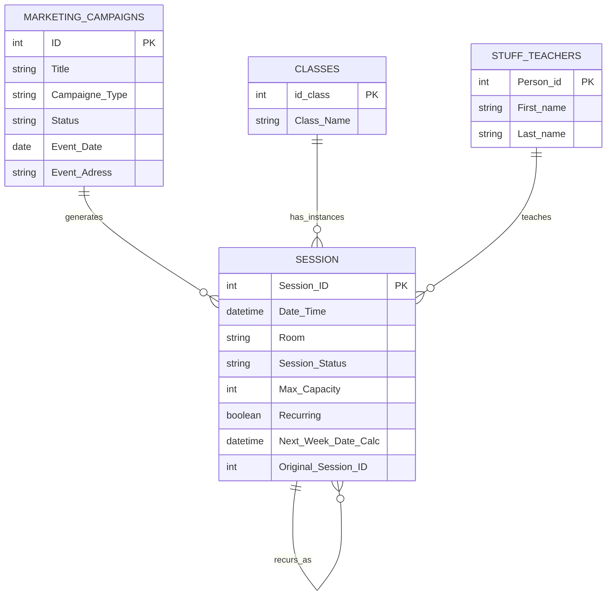

# 📁 Operations & Scheduling

> **2 native Airtable automations** handling class schedule continuity and event-to-calendar synchronization — keeping the studio timetable up to date without manual session creation.

---

## Tables Involved



---

## Contents

- [Recurring Sessions Generator](#recurring-sessions-generator)
- [Sync Event to Studio Calendar](#sync-event-to-studio-calendar)
- [Key Fields](#key-fields)
- [Interface](#interface)

---

## Recurring Sessions Generator

### Overview

When a session is marked as completed and has the `Recurring` toggle enabled, the automation **automatically creates the next session** scheduled exactly 7 days later — with all the same details carried over.

```
Session completed in Studio Planner
Recurring toggle = ✅
            ↓
[1] Recurring Sessions Generator fires
            ↓
New Session created in same table:
    ├── Class_Link        → copied from original
    ├── Primary Teacher   → copied from original
    ├── Room              → copied from original
    ├── Date & Time       → original + 7 days (Next_Week_Date_Calc)
    ├── Recurring         → ✅ (preserved)
    ├── Session_Status    → Scheduled
    └── Original_Session_ID → linked to source session
```

---

### Automation 1 — Recurring Sessions Generator

**Trigger:** Record matches conditions in `Session`
**Condition:** `Session_Status = Completed` AND `Recurring = ✅`

**Action:** Creates record in `Session`:

| Field | Value |
|---|---|
| `Class_Link` | Copied from original session |
| `Primary teacher` | Copied from original session |
| `Room` | Copied from original session |
| `Date & Time` | `Next_Week_Date_Calc` (original date + 7 days) |
| `Recurring` | `✅` (preserved for next cycle) |
| `Session_Status` | `Scheduled` |
| `Original_Session_ID` | Linked record ID of source session |

#### Formula: `Next_Week_Date_Calc`

```
DATEADD({Date & Time}, 7, 'days')
```

This formula lives in the `Session` table and calculates the next occurrence date automatically. The automation reads it at the moment of trigger.

---

### User Workflow

```
1. Admin opens Monthly Studio Planner
2. Creates a new session:
   → Selects Class, Teacher, Room, Date & Time
   → Toggles Recurring = ✅ for weekly classes

3. Session runs as normal

4. Admin marks Session_Status = Completed
   → Automation fires instantly
   → Next week's session appears in the calendar
   → No manual entry needed

5. To stop recurrence:
   → Open the newly created session
   → Toggle Recurring = ❌ before it completes
```

---

## Sync Event to Studio Calendar

### Overview

When a marketing event reaches **In Progress** status, the automation **automatically creates a corresponding session** in the studio calendar — linking the event to the scheduling system so it appears alongside regular classes.

```
Marketing_Campaigns record:
    Event_Date is set
    + Status = In Progress
    + Campaigne_Type = Event/Workshop
            ↓
[2] Sync Event to Studio Calendar fires
            ↓
New Session created:
    ├── If_Event       → linked to Marketing_Campaigns record
    ├── Date & Time    → Event_Date
    ├── Room           → Event_Adress
    └── Session_Status → Scheduled
```

---

### Automation 2 — Sync Event to Studio Calendar

**Trigger:** Record matches conditions in `Marketing_Campaigns`
**Condition:** `Event_Date` is not empty AND `Status = In Progress` AND `Campaigne_Type = Event/Workshop`

**Action:** Creates record in `Session`:

| Field | Value |
|---|---|
| `If_Event` | Linked record ID from `Marketing_Campaigns` |
| `Date & Time` | `Event_Date` from campaign |
| `Room` | `Event_Adress` from campaign |
| `Session_Status` | `Scheduled` |

---

### User Workflow

```
1. Marketing team creates a new campaign
   → Interface: Marketing Ops Hub → Marketing Campaigns Intake

2. Event details are filled in:
   → Title, Event_Date, Event_Adress, Campaigne_Type = Event/Workshop

3. When ready, Status is moved to In Progress
   → Interface: Marketing Ops Hub → Event Lifecycle Manager
   → Automation fires instantly
   → Session appears in studio calendar

4. Operations team can see the event in Monthly Studio Planner
   → Alongside regular recurring classes
   → Can update Room, assign teachers, track attendance
```

---

## Key Fields

| Field | Table | Type | Description |
|---|---|---|---|
| `Session_Status` | `Session` | Single select | `Scheduled` / `Confirmed` / `Completed` / `Cancelled` |
| `Recurring` | `Session` | Checkbox | When ✅ — triggers new session creation on completion |
| `Next_Week_Date_Calc` | `Session` | Formula | `DATEADD({Date & Time}, 7, 'days')` |
| `Original_Session_ID` | `Session` | Linked record | Traces recurring sessions back to their source |
| `Class_Link` | `Session` | Linked record | Links session to class type from `Classes` table |
| `Primary teacher` | `Session` | Linked record | Links session to teacher from `Stuff & Teachers` |
| `Room` | `Session` | Single select | `Main hall` / `Budda hall` / `Online` / `Outdoor` |
| `If_Event` | `Session` | Linked record | Links session to event campaign — set by Sync automation |
| `Campaigne_Type` | `Marketing_Campaigns` | Single select | Must be `Event/Workshop` to trigger calendar sync |
| `Event_Date` | `Marketing_Campaigns` | Date | Maps to `Date & Time` in new session |
| `Event_Adress` | `Marketing_Campaigns` | Text | Maps to `Room` in new session |

---

## Interface

**🖥️ Studio Operations Hub → Monthly Studio Planner**
Primary interface for managing the session calendar. Sessions are created, edited, and completed here. The `Recurring` toggle and `Session_Status` field — which drive Automation 1 — are managed from each session card.

**🖥️ Marketing Ops Hub → Marketing Campaigns Intake**
Where new events are registered. Filling in `Event_Date` and selecting `Event/Workshop` type prepares the record for calendar sync.

**🖥️ Marketing Ops Hub → Event Lifecycle Manager**
Kanban pipeline for event statuses. Moving a campaign to `In Progress` triggers Automation 2 — creating the session in the studio calendar automatically.

---

*[← Back to main README](./README.md)*
